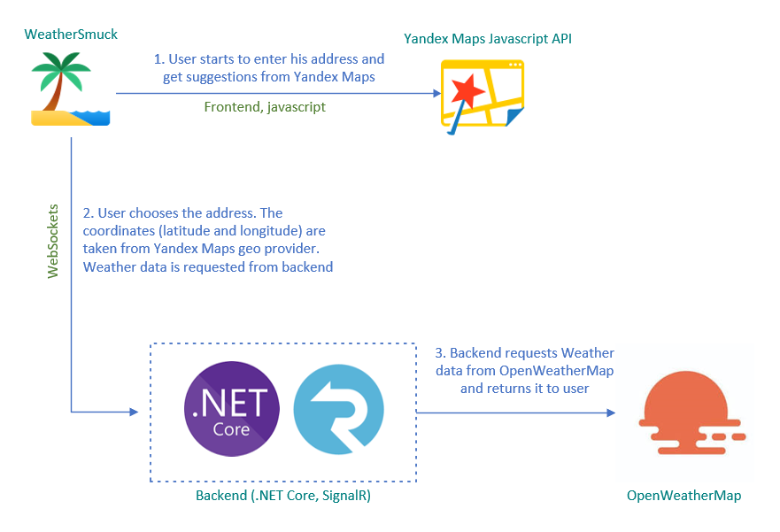

# WeatherSmuck
*Smart* weather service

Web application. Medium difficulty.

Try it [here](https://dzotov.ddns.net).


## Tech Stack
.NET Core (I know that you would prefer Python and Flask, but I chose the quickiest way for me), WebSockets, Yandex Maps API, OpenWeatherMapAPI, jQuery, Bootstrap.

## Processing
Less *words*, more *visual*.



## How to run it
Get .NET Core 3.1 (I'm really sorry, guys).

Set up your OpenWeatherMap API Key in **appsettings.json**. Don't hesitate to ask me and I will give it to you.

Run in command line:
```sh
dotnet restore
dotnet run --project ./WeatherSmuck/WeatherSmuck.proj
```
Open in browser: http://localhost:5000

Tested in Chrome and Firefox.

### Known issues
The territory is not fully restricted by Moscow bounds. It was made by adding "Moscow" in search geoprovider but should be done by setting bounds.

It's better to check the status of OpenWeatherMap API before user starts to choose the address.

~~Need to make the possibility to select an address by clicking on the map.~~ It's ready, but the code in js is more complicated now.

